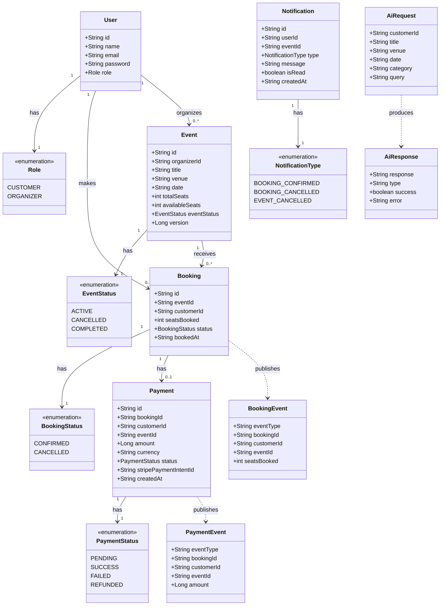

# Online Event Booking Platform

A production-grade, AI-powered event booking platform built with Java Spring Boot microservices architecture. The platform handles concurrent bookings, processes payments via Stripe, delivers async notifications through Apache Kafka, and provides intelligent AI features powered by Spring AI and Groq LLaMA 3.3.

---

## Table of Contents
- [Overview](#overview)
- [Class Diagram](#class-diagram)
- [Tech Stack](#tech-stack)
- [Services](#services)
- [Features](#features)
- [API Endpoints](#api-endpoints)
- [How to Run Locally](#how-to-run-locally)
- [Environment Variables](#environment-variables)

---

## Overview

This platform allows:
- **Organizers** to create, update and cancel events
- **Customers** to browse events, book tickets, and make payments
- **AI-powered** natural language search, personalized recommendations, and automated event description generation
- **Automated refunds** when bookings are cancelled after payment

---

## Class Diagram



---

## Tech Stack

| Category | Technology | Purpose |
|---|---|---|
| Language | Java 21 | Core language |
| Framework | Spring Boot 3.5.x | Microservices framework |
| AI | Spring AI + Groq LLaMA 3.3 | Smart search, recommendations, descriptions |
| Messaging | Apache Kafka 3.7 | Async inter-service communication |
| Caching | Redis 7.0 | Active events caching (~60% DB query reduction) |
| Database | MongoDB + Atlas | Document storage |
| Security | Spring Security + JWT | Authentication & authorization |
| Payments | Stripe | Payment processing & refunds |
| Containerization | Docker | Local infrastructure |
| Deployment | Railway | Cloud deployment |
| Testing | JUnit 5 + Mockito | Unit testing (~80% coverage) |

---

## Services

| Service | Port | Responsibility |
|---|---|---|
| **User Service** | 8081 | Registration, login, JWT generation |
| **Event Service** | 8082 | Event CRUD, Redis caching |
| **Booking Service** | 8083 | Ticket booking, cancellation, Kafka producer |
| **Notification Service** | 8084 | Kafka consumer, notification storage |
| **Payment Service** | 8085 | Stripe integration, auto refunds |
| **AI Service** | 8086 | Smart search, recommendations, descriptions |

---

## Features

### Security
- Stateless JWT authentication across all microservices
- Role-based access control (CUSTOMER vs ORGANIZER)
- User impersonation prevention via JWT claim validation
- Path-level endpoint protection with Spring Security

### Booking
- Concurrent booking protection using atomic MongoDB operations
- Optimistic locking with `@Version` field as safety net
- Fail-fast validation before any database operations
- Zero overbooking under simulated high concurrent load

### Payments
- Stripe Payment Intent creation and confirmation
- Automated refund processing on booking cancellation
- Payment lifecycle management (PENDING → SUCCESS → REFUNDED)
- Test and production mode via environment-based configuration

### Notifications
- Async notification delivery via Apache Kafka
- Zero notification loss — Kafka persists messages during downtime
- Notification types: booking confirmed, cancelled, payment refunded
- Mark as read functionality

### Performance
- Redis caching for active events (10-minute TTL)
- Cache eviction on event updates/cancellations
- ~60% reduction in MongoDB queries for frequently accessed data

### AI Features (Spring AI + Groq LLaMA 3.3)
- **Smart Search**: Natural language event search
- **Recommendations**: Personalized event suggestions based on booking history
- **Description Generator**: AI-generated professional event descriptions

---

## API Endpoints

### User Service (8081)
| Method | Endpoint | Description | Auth |
|---|---|---|---|
| POST | `/api/users/register` | Register new user | Public |
| POST | `/api/users/login` | Login and get JWT | Public |
| GET | `/api/users/{id}` | Get user by ID | JWT |

### Event Service (8082)
| Method | Endpoint | Description | Auth |
|---|---|---|---|
| POST | `/api/events` | Create event | ORGANIZER |
| PUT | `/api/events/{id}` | Update event | ORGANIZER |
| PATCH | `/api/events/{id}/cancel` | Cancel event | ORGANIZER |
| GET | `/api/events/active` | Browse active events | Public |
| GET | `/api/events/{id}` | Get event by ID | JWT |
| GET | `/api/events/search?keyword=x` | Search by keyword | Public |
| GET | `/api/events/organizer/{id}` | Get organizer events | JWT |

### Booking Service (8083)
| Method | Endpoint | Description | Auth |
|---|---|---|---|
| POST | `/api/bookings` | Book ticket | CUSTOMER |
| PATCH | `/api/bookings/{id}/cancel` | Cancel booking | CUSTOMER |
| GET | `/api/bookings/{id}` | Get booking | JWT |
| GET | `/api/bookings/customer/{id}` | Get customer bookings | JWT |
| GET | `/api/bookings/event/{id}` | Get event bookings | JWT |

### Notification Service (8084)
| Method | Endpoint | Description | Auth |
|---|---|---|---|
| GET | `/api/notifications/user/{id}` | Get all notifications | JWT |
| GET | `/api/notifications/user/{id}/unread` | Get unread | JWT |
| PATCH | `/api/notifications/{id}/read` | Mark as read | JWT |

### Payment Service (8085)
| Method | Endpoint | Description | Auth |
|---|---|---|---|
| POST | `/api/payments/create` | Create payment intent | JWT |
| POST | `/api/payments/confirm/{intentId}` | Confirm payment | JWT |
| POST | `/api/payments/refund` | Refund payment | JWT |
| GET | `/api/payments/booking/{id}` | Get by booking | JWT |
| GET | `/api/payments/customer/{id}` | Payment history | JWT |

### AI Service (8086)
| Method | Endpoint | Description | Auth |
|---|---|---|---|
| GET | `/api/ai/recommendations/{customerId}` | Get recommendations | Public |
| POST | `/api/ai/generate-description` | Generate description | Public |
| GET | `/api/ai/search?query=x` | Smart search | Public |

---

## How to Run Locally

### Prerequisites

```bash
# Required installations:
Java 21
Maven 3.9+
Docker Desktop
Apache Kafka 3.7
IntelliJ IDEA (recommended)
```

### Step 1: Start Infrastructure

```bash
# Start MongoDB
docker run -d --name eventbooking-mongodb -p 27017:27017 mongo:5.0

# Start Redis
docker run -d --name eventbooking-redis -p 6379:6379 redis:7.0

# Start Zookeeper (new terminal)
cd C:\kafka37\kafka_2.13-3.7.0
bin\windows\zookeeper-server-start.bat config\zookeeper.properties

# Start Kafka (new terminal)
cd C:\kafka37\kafka_2.13-3.7.0
bin\windows\kafka-server-start.bat config\server.properties
```

### Step 2: Configure Environment Variables

> Create environment variables in your IDE run configuration for each service. See [Environment Variables](#environment-variables) section.

### Step 3: Run Services

```bash
# Run each service in IntelliJ:
# Right click *Application.java → Run

# Order:
# 1. UserServiceApplication        (port 8081)
# 2. EventServiceApplication       (port 8082)
# 3. BookingServiceApplication     (port 8083)
# 4. NotificationServiceApplication (port 8084)
# 5. PaymentServiceApplication     (port 8085)
# 6. AiServiceApplication          (port 8086)
```

### Step 4: Test APIs

Import the Postman collection from `/postman` folder and test all endpoints.

---

## Environment Variables

Create these in your IDE run configuration for each service:

```properties
# All Services
SPRING_DATA_MONGODB_URI=mongodb://localhost:27017/eventbooking_db

# User Service
JWT_SECRET=your_jwt_secret_key_min_32_chars

# Payment Service
STRIPE_SECRET_KEY=sk_test_your_stripe_key

# AI Service
GROQ_API_KEY=gsk_your_groq_api_key
```
